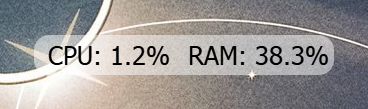
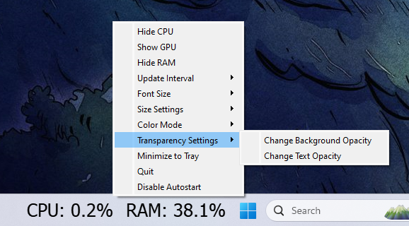

# Resource Monitor Widget

A simple and customizable resource monitor widget for Windows 11 that displays the current usage of CPU, GPU, and RAM. The widget can be resized and moved freely on the screen or fixed in a specific position. It also supports autostart with the OS and allows for various customizations, such as font size, transparency, and color modes.



## Features
- Monitors CPU, GPU, and RAM usage.
- Resizable and movable widget.
- Can autostart with Windows 11.
- Supports background and text transparency control.
- Allows customization of font size and update interval.
- Color mode options: system colors, dynamic color based on usage.

## Simple start
- Just copy the file `resource_monitor.exe` to your PC and then run it.
- This simple method may not work correctly on Windows versions below 11.
- If `resource_monitor.exe` starts with an error, try to install and run it using `resource_monitor.py` following the instructions below.

## Installation

1. Clone the repository:
   ```
   git clone https://github.com/AlexKlos/ResourceMonitor.git
   cd resource-monitor
   ```

2. Create and activate a virtual environment:
   ```
   python -m venv venv
   venv\Scripts\activate  (for Windows)
   ```

3. Install the required dependencies:
   ```
   pip install -r requirements.txt
   ```

4. Run the application:
   ```
   python resource_monitor.py
   ```

## Autostart Setup

The application can be set to run at startup. If enabled through the settings, copies it .exe to the folder `LOCALAPPDATA\Resource Monitor`, writes the key to the registry to ensure the application launches without the console window.

## Customization Options

- **Metrics Selection**: Choose which metrics to display (CPU, GPU, RAM).
- **Font Size**: Adjustable to any value via the context menu.
- **Widget Size**: Fully customizable width and height, with no minimum size restrictions.
- **Transparency**: Control the transparency of the background and text independently.
- **Color Modes**:
    - **System Colors**: Matches the system's theme colors.
    - **Dynamic Colors**: Text color changes dynamically based on the resource usage percentage (e.g., green for low usage, yellow for medium, red for high).
- **Update Interval**: Change the refresh rate for updating metrics (e.g., every 1 second, 2 or 5 seconds).
- **Startup Position**: Saves the widget's position on the screen and restores it upon the next launch.
- **Autostart**: Enable or disable launching the widget at system startup.



## Requirements

- Python 3.x
- PyQt5
- GPUtil

## License
MIT License
